# 🛡️ PaySim Fraud Detection Agent

Advanced, explainable fraud detection system for mobile money transactions using **LangGraph** + **GPT-4o-mini** with a structured **weighted multi-signal framework**.

Built on the synthetic **PaySim** dataset — production-style prompt engineering, conservative decision logic, interactive Streamlit UI, and data-driven insights.

<p align="center">
  
  
  
  
</p>

## Diagram 


## ✨ Key Features

- Structured LLM reasoning with **weighted 4-signal scoring**
- Strongest signals: Account Behavior (40%) + Balance Anomaly (40%)
- Conservative fraud logic — defaults to LEGITIMATE when uncertain
- ReAct agent built with LangGraph
- Fast parquet data loading (~10× faster)
- Clean interactive **Streamlit** dashboard
- **Comprehensive EDA** performed on full dataset

## 📊 Decision Framework (Production Rules)

| Score Range     | Fraud Probability | Decision       |
|-----------------|-------------------|----------------|
| ≤ +1.0          | 5–20%             | LEGITIMATE     |
| +1.1 – +2.0     | 50%               | SUSPICIOUS     |
| > +2.0          | 75%               | FRAUD          |

**Hard safeguards**: Never flag fraud based on single signal (especially balance or amount alone). PAYMENT / CASH_IN / DEBIT → always LEGITIMATE.

## 🔍 Exploratory Data Analysis

**Key Insight**: Fraud is extremely rare (**0.13%**) and occurs **exclusively** in TRANSFER and CASH_OUT transactions — perfectly validating the prompt’s type-based gating logic.

Full EDA notebook: `notebooks/01_eda.ipynb`
```
## 🗂 Project Structure
paysim-fraud-agent/
├── data/
│   ├── paysim.csv
│   └── paysim.parquet             # recommended (10× faster)
├── notebooks/
│   └── 01_eda.ipynb               # Exploratory Data Analysis
├── src/
│   ├── data/loader.py
│   ├── agent/
│   ├── prompts.py
│   └── config.py
├── app.py                         # Streamlit demo
├── .env
├── requirements.txt
└── README.md
```


## ⚙️ Core Signals & Weights

| Signal                | Weight | Strength      |
|-----------------------|--------|---------------|
| Account Behavior      | 40%    | **Strongest** |
| Balance Anomaly       | 40%    | Strong        |
| Destination Type      | 10%    | Contextual    |
| Amount Context        | 10%    | Weak          |

## 🏗️ Full System & Data Pipeline Architecture

```mermaid
flowchart LR

    %% ─────────────────────────────
    %% DATA LAYER
    %% ─────────────────────────────
    A[PaySim Raw Dataset<br>CSV ~6.3M rows] --> B[Data Preprocessing]
    B --> C[Parquet Optimization]
    C --> D[Efficient Data Loader]

    %% ─────────────────────────────
    %% APPLICATION LAYER
    %% ─────────────────────────────
    D --> E[Streamlit UI<br>User Transaction Input]

    E --> F{Transaction Type Gate}

    F -->|PAYMENT / CASH_IN / DEBIT| G[Auto Legitimate<br>Bypass Agent]

    F -->|TRANSFER / CASH_OUT| H[LangGraph ReAct Agent]

    %% ─────────────────────────────
    %% AGENT TOOLING
    %% ─────────────────────────────
    H --> I[Tool: Account History Lookup]
    H --> J[Tool: Balance Analysis]
    H --> K[Tool: Merchant Detection]
    H --> L[Tool: Pattern Evaluation]
    H --> M[Tool: Signal Aggregator]

    I --> N[Weighted Scoring Engine]
    J --> N
    K --> N
    L --> N
    M --> N

    %% ─────────────────────────────
    %% DECISION LAYER
    %% ─────────────────────────────
    N --> O[Conservative Decision Logic]
    O --> P[Structured Output Formatter]

    %% ─────────────────────────────
    %% OUTPUT LAYER
    %% ─────────────────────────────
    P --> Q[Step-by-Step Reasoning]
    P --> R[Fraud Probability]
    P --> S[Final Decision]

    Q --> T[Streamlit Dashboard]
    R --> T
    S --> T
```


## 📈 Loading Performance

| Sample | Parquet Time | Memory   |
|--------|--------------|----------|
| 1%     | ~0.5s        | ~100 MB  |
| 10%    | ~5s          | ~800 MB  |
| 100%   | ~20s         | ~6.5 GB  |

## 🔮 Next Steps (AI Portfolio Ready)

- Quantitative evaluation (F1 / Precision / Recall / AUC)
- Classical ML baseline (XGBoost / LightGBM) comparison
- FastAPI + Docker deployment
- MLflow experiment tracking

## 📄 License

MIT

---

**Built to showcase production-grade LLM agent engineering, explainable AI, and strong data understanding**  
Open to feedback & contributions!
