# 🛡️ PaySim Fraud Detection Agent

Advanced, explainable fraud detection system for mobile money transactions using **LangGraph** + **GPT-4o-mini** with a structured **weighted multi-signal framework**.

Built on the synthetic **PaySim** dataset — production-style prompt engineering, conservative decision logic, interactive Streamlit UI, and data-driven insights.
---
<p align="center">
  
  
  
  
</p>

---

## 📈 Dataset – PaySim
- Kaggle : https://www.kaggle.com/datasets/ealaxi/paysim1
- ~6.36 million synthetic mobile money transactions
- Simulated over 744 hours (~1 month)
- 11 columns: step, type, amount, nameOrig, oldbalanceOrg, newbalanceOrig, nameDest, oldbalanceDest, newbalanceDest, isFraud, isFlaggedFraud
- **Fraud rate**: ~0.129% (extremely imbalanced)
- **Fraud occurs exclusively** in TRANSFER and CASH_OUT transactions
- No fraud cases in PAYMENT, CASH_IN or DEBIT
- Balance anomalies appear even in many legitimate transactions
- Merchant accounts usually start with 'M' in nameDest

---
## Diagram 


---

## ✨ Key Features

- Structured LLM reasoning with **weighted 4-signal scoring**
- Strongest signals: Account Behavior (40%) + Balance Anomaly (40%)
- Conservative fraud logic — defaults to LEGITIMATE when uncertain
- ReAct agent built with LangGraph
- Fast parquet data loading (~10× faster)
- Clean interactive **Streamlit** dashboard
- **Comprehensive EDA** performed on full dataset

---
## 📊 Decision Framework (Production Rules)

| Score Range     | Fraud Probability | Decision       |
|-----------------|-------------------|----------------|
| ≤ +1.0          | 5–20%             | LEGITIMATE     |
| +1.1 – +2.0     | 50%               | SUSPICIOUS     |
| > +2.0          | 75%               | FRAUD          |

**Hard safeguards**: Never flag fraud based on single signal (especially balance or amount alone). PAYMENT / CASH_IN / DEBIT → always LEGITIMATE.

## 🔍 Exploratory Data Analysis

**Key Insight**: Fraud is extremely rare (**0.13%**) and occurs **exclusively** in TRANSFER and CASH_OUT transactions — perfectly validating the prompt’s type-based gating logic.

Full EDA notebook: `notebooks/01_eda.ipynb`
```
## 🗂 Project Structure
paysim-fraud-agent/
├── data/
│   ├── paysim.csv
│   └── paysim.parquet             # recommended (10× faster)
├── notebooks/
│   └── 01_eda.ipynb               # Exploratory Data Analysis
├── src/
│   ├── data/loader.py
│   ├── agent/
│   ├── prompts.py
│   └── config.py
├── app.py                         # Streamlit demo
├── .env
├── requirements.txt
└── README.md
```


## ⚙️ Core Signals & Weights

| Signal                | Weight | Strength      |
|-----------------------|--------|---------------|
| Account Behavior      | 40%    | **Strongest** |
| Balance Anomaly       | 40%    | Strong        |
| Destination Type      | 10%    | Contextual    |
| Amount Context        | 10%    | Weak          |

## 🏗️ Full System & Data Pipeline Architecture

```mermaid
flowchart TD
    A[Input Transaction\nJSON / DataFrame row] --> B{Type?}
    
    B -->|PAYMENT\nCASH_IN\nDEBIT| C[LEGITIMATE\n5% probability]
    B -->|TRANSFER\nCASH_OUT| D[ReAct Agent\n4-Signal Scoring]
    
    D --> E1[Tool: get_origin_history\n→ Account Behavior 40%]
    D --> E2[Tool: check_balance_anomaly\n→ Balance Anomaly 40%]
    D --> E3[Tool: is_merchant_account\n→ Destination Type 10%]
    D --> E4[Tool: amount check\n→ Amount Context 10%]
    
    E1 & E2 & E3 & E4 --> F[Calculate Total Score]
    
    F --> G{Score Threshold}
    
    G -->|≤ +1.0| H[LEGITIMATE\n5–20%]
    G -->|+1.1 to +2.0| I[SUSPICIOUS\n50%]
    G -->|> +2.0| J[FRAUD\n75%]
    
    H & I & J --> K[Structured Output\n• Step-by-step reasoning\n• Probability\n• Final Decision]
```


## Video 


## 📈 Loading Performance

| Sample | Parquet Time | Memory   |
|--------|--------------|----------|
| 1%     | ~0.5s        | ~100 MB  |
| 10%    | ~5s          | ~800 MB  |
| 100%   | ~20s         | ~6.5 GB  |

## 🔮 Next Steps (AI Portfolio Ready)

- Quantitative evaluation (F1 / Precision / Recall / AUC)
- Classical ML baseline (XGBoost / LightGBM) comparison
- FastAPI + Docker deployment
- MLflow experiment tracking

## 📄 License

MIT

---

**Built to showcase production-grade LLM agent engineering, explainable AI, and strong data understanding**  
Open to feedback & contributions!
